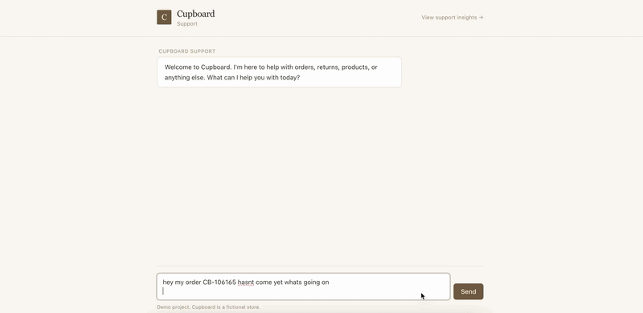

# Cupboard Support

A multi-agent customer support system for a fictional home goods store. Built from scratch on the Claude API to demonstrate how AI handles real CX volume, where it breaks, and how to measure the difference.

**Stack:** Next.js 14 · Supabase · Claude API (Haiku for triage, Sonnet for specialists) · Vercel · TypeScript · Tailwind

**Live:** [cupboard-support.vercel.app](https://cupboard-support.vercel.app) · **Dashboard:** [cupboard-support.vercel.app/dashboard](https://cupboard-support.vercel.app/dashboard)



---

## Why this exists

I'm a CX leader, not an engineer. But every CX team in 2026 is being asked the same questions about AI tooling - what gets deflected, what should never get touched, how do we know if it's actually working - and the only way I knew to develop a real point of view on those questions was to build the thing myself.

So I did. Cupboard is a multi-agent support system that handles ~70% of typical e-commerce CX volume, knows when to bring in a human, and exposes the data a CX manager would actually use to decide where to invest next. It's also a writeup of what I learned doing it, including the parts where I was wrong.

## How this was built

I built this with Claude as my coding collaborator. I made every decision, wrote every prompt, designed every CX flow, decided what to build and what to scope out, ran the evals, and iterated based on what the results showed. Claude wrote most of the code based on those decisions - the same way an engineer might use a junior developer to translate a design spec into working software.

I'm calling this out because it's worth being clear about. The CX thinking, the agent boundaries, the empathy register, the eligibility logic, the dashboard widgets, the deflection opportunity framing - those are mine. The TypeScript and SQL came out of a collaboration. If a hiring manager asks "could you have done this without AI?" the honest answer is no, but using AI to translate good CX thinking into working code is exactly the kind of skill the next generation of CX roles will value.

## What's here

**A working multi-agent system.** A triage agent (Haiku) routes incoming messages to the right specialist. Two specialists are built: Order Status (read-only, with severity-tiered empathy based on how long an order has been waiting) and Returns (write actions with server-side eligibility guardrails so the agent can initiate in-policy returns but escalates damage claims and out-of-window cases). Conversation state tracks who's currently handling the customer, so follow-up messages route correctly mid-conversation.

**An eval suite of 23 cases** drawn from real CX scenarios I've handled in my career. Every prompt change runs through the suite and produces a measurable accuracy delta. Triage-only mode runs for ~$0.02; full-suite mode (with tool calls) runs for ~$0.30. The eval caught things I wouldn't have noticed by spot-testing - places where my own grading logic was wrong, edge cases the prompts missed, decisions that felt right but didn't survive contact with 23 cases.

**An analytics dashboard** with six widgets: volume by intent, deflection rate by agent, average resolution time, escalation reason breakdown, tool reliability, and a deflection opportunity ranking that orders intents by `volume × handoff rate`. The opportunity widget is the one that reads like a CX leadership memo: *"Returns has 110 conversations in the window with 45% handoff. Improving its deflection by 20 points would save ~10 hours of agent time per month."*

## Architecture

```
                    ┌──────────────────┐
   Customer ───────▶│   Triage Agent   │  Haiku, prompt-cached
                    │ (intent + entity │  ~500 tokens, ~$0.001/call
                    │   extraction)    │
                    └────────┬─────────┘
                             │ routes by intent
                ┌────────────┼────────────┐
                ▼            ▼            ▼
          ┌──────────┐  ┌─────────┐  ┌─────────┐
          │  Order   │  │ Returns │  │  Human  │
          │  Status  │  │         │  │ Handoff │
          └─────┬────┘  └────┬────┘  └─────────┘
                │            │
        Sonnet, tool use, conversation state.
        Severity computed deterministically
        (Order Status) or via verdict logic
        (Returns) - prompts don't decide
        what's eligible.
                │            │
                └─────┬──────┘
                      ▼
            All routing decisions, tool
            calls, and escalation triggers
            logged to analytics_events
                      │
                      ▼
              ┌──────────────┐
              │  Dashboard   │  /dashboard
              │ (six widgets)│  public, "demo data" labeled
              └──────────────┘
```

### What makes this different from a typical "AI support agent"

Most AI support demos are a single Claude prompt with a fancy name. This is built differently in a few specific ways:

- **Real specialist routing.** Triage is a separate model call (Haiku) that returns structured JSON. The chat orchestration layer reads that JSON, applies escalation rules, and dispatches to the right specialist. No specialist sees a message that wasn't routed to it.

- **Tool guardrails are server-side.** The Returns agent can initiate returns, but `initiate_return` re-validates eligibility before writing to the database, even though the prompt instructs it not to call the tool unless eligible. Prompts can change - policies within the database don't.

- **Conversation continuity.** When a customer replies "yes please" or "refund" mid-conversation, triage classifies that as `continuation` and the chat route reads `current_agent` from the conversation record to keep them with the same specialist. Without this, every message would re-triage from scratch and lose context.

- **Severity-tiered empathy.** Order Status doesn't just say "your order is delayed." It computes a severity (low/moderate/high/critical) based on days waiting, ETA gap, and order status, and the prompt has explicit rules for the empathy register at each tier. A 1-day delay gets "I see your order is taking a bit longer than expected." A lost order gets "I'm so sorry - I can see this didn't reach you, and that's not okay."

## Eval suite

| Run | Mode | Cases | Pass | Cost | Time |
|-----|------|-------|------|------|------|
| v1-locked-rerun | triage_only | 15 | **15/15** | $0.02 | 21s |
| v2-returns | triage_only | 23 | **20/23** | $0.02 | 25s |
| v3-final | triage_only | 23 | **23/23** | $0.02 | 23s |

The 20/23 run was the most useful one. Three different things failed for three different reasons - one was an old test case from earlier in the build that hadn't been updated when I added a new specialist, one was a real prompt issue (triage wasn't catching profanity the way it should), and one was a problem with how I was grading the tests themselves. None of those would have shown up in spot-testing. The whole point of the eval is that it caught all three in 25 seconds for two cents.

## Setup

### 1. Supabase

Create a project at [supabase.com](https://supabase.com), then run the SQL files in `/supabase/` in order (they're numbered). They handle: schema creation, seed data, eval setup, returns schema, dashboard simulation, and a couple of cleanup migrations.

### 2. Environment variables

```
NEXT_PUBLIC_SUPABASE_URL=...
NEXT_PUBLIC_SUPABASE_ANON_KEY=...
SUPABASE_SERVICE_ROLE_KEY=...
ANTHROPIC_API_KEY=...
```

### 3. Deploy

Built for the github.dev → Vercel auto-deploy workflow. Push the repo, import it in Vercel, add the env vars, deploy. No local dev required.

## What I learned building this

A few things that surprised me along the way.

**Severity belongs in code, not in the prompt.** I tried having the agent compute "how concerned should I be?" from the order data in its system prompt. It would correctly read a 30-day delay and then sometimes call it a small delay anyway. Moving severity into a deterministic helper that returns `{verdict, severity}` and having the prompt branch on the tier fixed it. Prompts decide tone. Tools decide facts.

**Empathy is a register, not a setting.** "Add empathy to the prompt" doesn't work. What worked was specifying the empathy beat per severity tier: low gets none at all, moderate gets a light acknowledgment, high gets validation, critical gets ownership. Specifying when not to be empathetic mattered as much as specifying when to be. Customers reading "I'm so sorry that your delivery is taking until tomorrow" find it weird. They're right.

**The eval surfaced bugs in the eval, not just the system.** The first time I ran the suite I got 10/15 with several "failures" that turned out to be cases where the grading itself was wrong - I was checking things in triage-only mode that triage-only mode physically can't produce. That's a category of bug I would not have hit by spot-testing. You only find it by running the suite and asking why a passing system looks broken.

**The opportunity widget is the actual analyst tool.** I built five other widgets first - volume, deflection, duration, escalation reasons, tool reliability. They're useful. But the one that reads like a memo is `volume × handoff rate`, ranked. That's not a chart, it's a prioritization. Building dashboards as "what data do I have" produces charts. Building them as "what decision does this need to support" produces something a CX leader actually uses.

**Documenting what I didn't build was harder than building it.** The "deliberate scope choices" section took longer to write than most of the prompts. Saying "I didn't do identity verification, here's why, here's what production would do instead" is a stronger signal than half-implementing it would have been. Cutting scope on purpose, and being able to defend the cut, is a skill the build forced me to practice.

## Deliberate scope choices

A few things this system intentionally doesn't do. I'm calling them out so it's clear they were considered, not missed.

**Identity verification.** Right now anyone who knows an order number can start a return. A real system would require email-on-account match or a magic link before any write action - you don't want random people, or someone's scorned ex, cancelling orders through a chatbot. I scoped this out because adding real auth turns this into a different project. In production, the chat would gate on a logged-in session.

**A real returns workflow.** I represented returns as five fields on the orders table. A real returns system has its own table tracking line items, inspection states, restocking fees, and exchange routing. Cupboard tracks the customer-visible state only and stops there.

**Attachment handling.** When the Returns agent asks for a photo on a damage claim, the chat can't actually accept files. The customer asking is still useful (they can describe the damage or screenshot it for the human teammate), but a real system would handle uploads with size limits, virus scanning, and storage.

**Real auth on the admin page.** The eval admin page is gated by a sessionStorage "are you sure?" prompt. Anyone determined enough could click through it. Same reasoning as identity verification - real auth was a different project.

## What this is not

A production support system. The seed data is fake, the policies are fictional, no real money moves. A wrapper around an agent framework - everything is built directly against the Claude API for transparency. A solo prompt with a fancy name.

---

Built by [Blake](https://www.linkedin.com/in/) - CX leader exploring the intersection of customer experience and AI tooling. Open to conversations about CX Manager, CX Analyst, and Voice of Customer Analyst roles.
